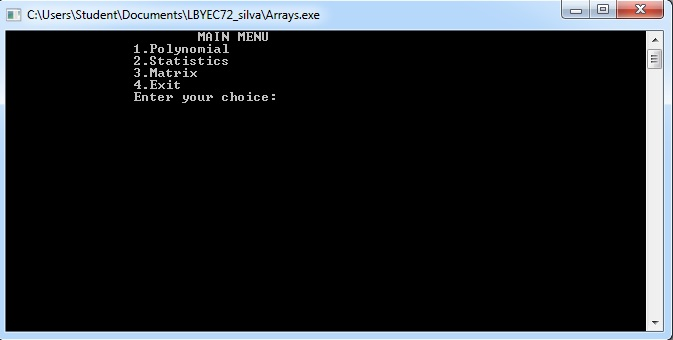
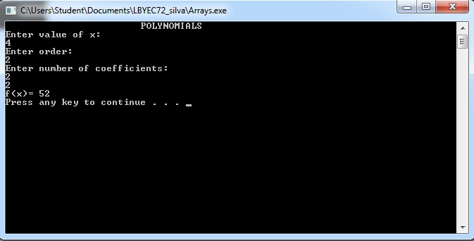
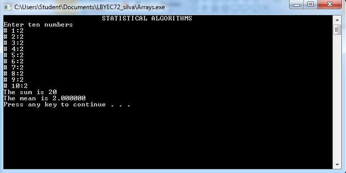
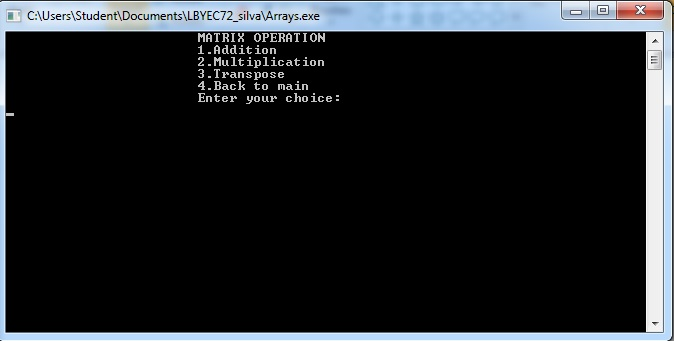
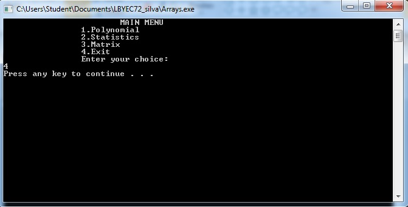

# lbyec72-ej1-p3-single_multidimensional_arrays-mnsarias
lbyec72-ej1-p3-single_multidimensional_arrays-mnsarias created by GitHub Classroom

The activity entailed the usage of arrays for each program. This screenshot shows the main page and the operations that the user may choose from.

This page shows the calculation of a polynomial.

This page shows the calculation of mean, standard deviation and summation based on a given set of data that the user inputs.

This page will show the calculation of various matrix operations.

This shows the exit page.

